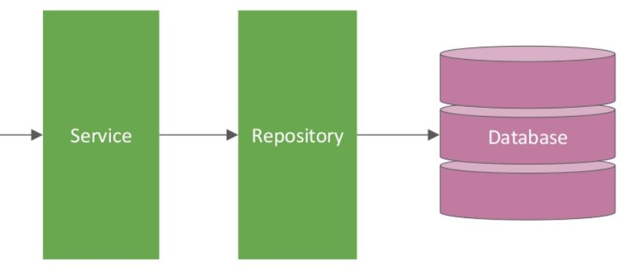

# Section 2 - (DB Storage and Repository)

## 1. Service - Repository - DB

The next task is to create another implementation of the ServiceInterface: this time, the data will be stored in a DB.

Beacause working with a database is a more complex operation than kepping the items we work with in memory or writing them into a file, we have decided to add one more layer of abstraction between the service and the actual DB.

In our project, the class that will be responsible for the DB communication will be called **ItemRepository** and it is implementing the methods defined in the **RepositoryInterface** class.



## 2. DB Storage Implementation

Add implementation for the **DBStorageImpl** class. You can start by calling the methods from RepositoryInterface, assuming the Repository is already implemented.

*you can call the method "exists" to check by id if an Item is present such as in the following eaxample:*

```java
    if(!itemRepository.exists(id)){
        throw new NullPointerException("the Item with the id: " + id + " was not added to the DB");
    }
```

## 3. Run the unit tests

- Go to test > section2 > **DBStorageImplTests**
- Right-click on the on the class (*DBStorageImplTests*)
- Run as > JUnit Test

## 4. Item Repository implementation

**ItemRepositoryImpl** is the class where have to implement the given methods on the DB of your choice.  
